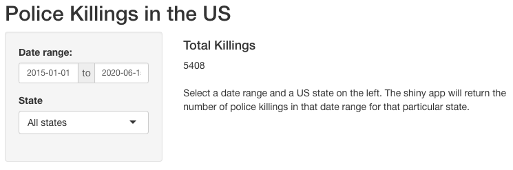

```{r setup, include=FALSE}
knitr::opts_chunk$set(echo = FALSE)
```

# What does it do?
- Takes a date range input
- Takes a US state input
- Returns the total number of killings by police officers in the selected state for the selected date range



# How does it work?

```{r, include = F}
library(tidyverse); library(lubridate); library(shiny)
pk <- read_csv("https://raw.githubusercontent.com/washingtonpost/data-police-shootings/master/fatal-police-shootings-data.csv")
pk <- pk %>% mutate(manner_of_death = as.factor(manner_of_death),
                    armed = as.factor(armed), gender = as.factor(gender),
                    race = as.factor(race), state = as.factor(state),
                    threat_level = as.factor(threat_level),
                    flee = as.factor(flee))
```

```{r, echo = T}
state1 <- "WA"
startDate1 <- ymd("2016-01-01")
endDate1 <- ymd("2016-12-01")
re_data <- pk %>% filter(date >= startDate1, date <= endDate1, state == state1)
nrow(re_data)
```

The total number of killings in `r state1` from `r startDate1` to `r endDate1` were `r nrow(re_data)`

# Example 2

```{r, echo = T}
state2 <- "CA"
startDate2 <- ymd("2015-01-01")
endDate2 <- ymd("2020-06-15")
re_data <- pk %>% filter(date >= startDate2, date <= endDate2, state == state2)
nrow(re_data)
```

The total number of killings in `r state2` from `r startDate2` to `r endDate2` were `r nrow(re_data)`

# server.R code

```{r, echo = T, eval = F}
library(shiny); library(tidyverse)

pk <- read_csv("https://raw.githubusercontent.com/washingtonpost/data-police-shootings/master/fatal-police-shootings-data.csv")
pk <- pk %>% mutate(manner_of_death = as.factor(manner_of_death),
                    armed = as.factor(armed), gender = as.factor(gender),
                    race = as.factor(race), state = as.factor(state),
                    threat_level = as.factor(threat_level),
                    flee = as.factor(flee))

shinyServer(function(input, output, session) {
    reTotal <- reactive({
        if (input$state == "All states") {
            re_data <- pk %>% filter(date >= input$dates[1],
                                     date <= input$dates[2])
        }
        else {
            re_data <- pk %>% filter(
                date >= input$dates[1], date <= input$dates[2],
                state == input$state)
        }
        nrow(re_data)
    })
    output$outDate <- renderText(paste("Total police killings from",
                                       as.character(input$dates[1]), "to",
                                       as.character(input$dates[2])))
    output$outState <- renderText(input$state)
    output$TotalKillings <- isolate(reTotal)
})
```


